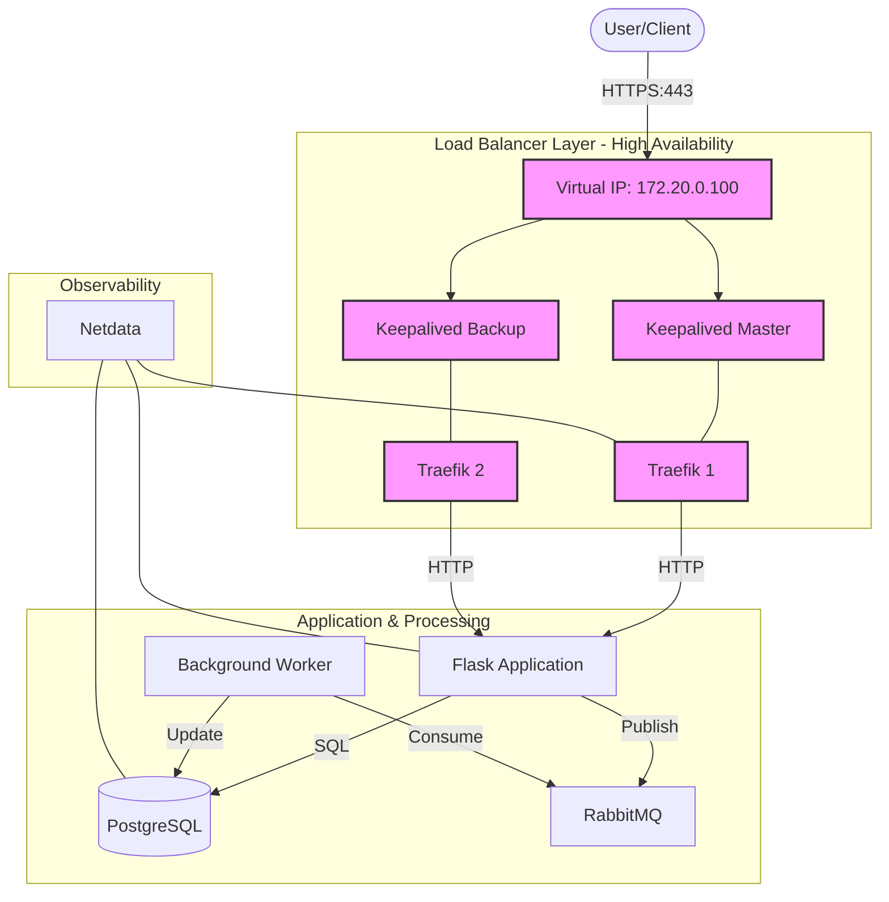

# High-Availability Containerized Web Platform

This project implements a highly available containerized web application platform with OS-level clustering concepts, TLS, monitoring, and async processing.

## Architecture



### Component Details

#### 0. Docker API Proxy
- **Custom Python Proxy**: Due to macOS Docker Engine (v29+) enforcing a minimum API version (1.44), and Traefik's legacy initialization (v1.24), a custom proxy is used.
- **Function**: It strips version prefixes from API calls and rewrites headers to ensure compatibility.
- **Configuration**: Mounts the host's real Docker socket (verified at `/Users/aleks/.docker/run/docker.sock`).

#### 1. Load Balancer Layer (Traefik & Keepalived)
- **Traefik (v3.1)**: Edge router handling TLS and discovery.
    - **Configuration**: Managed via `docker-compose.yml` and `lb/dynamic.yml`.
    - **Features**: Automatic HTTP-to-HTTPS redirection, SSL/TLS management with self-signed certificates.
- **Keepalived**: Manages the Virtual IP (VIP) `172.20.0.100`. 
    - **Mechanism**: Uses VRRP (Virtual Router Redundancy Protocol). The Master node holds the VIP; if it fails, the Backup node takes over.
    - **Health Checks**: Monitors the Traefik process using `killall -0 traefik`.

#### 2. Application Layer (Flask)
- **Framework**: Flask with SQLAlchemy ORM.
- **Server**: Gunicorn (as configured in the Dockerfile).
- **Statelessness**: The app stores no local state, allowing easy scaling. All state is in PostgreSQL or RabbitMQ.
- **Endpoints**:
    - `GET /items`: List all items.
    - `POST /items`: Create a new item.
    - `POST /items/<id>/process`: Enqueue a background job to RabbitMQ.

#### 3. Database Layer (PostgreSQL)
- **Version**: 15 (Alpine based).
- **Persistence**: Data is persisted in a Docker volume `db_data`, ensuring it survives container restarts.
- **Access**: Restricted to the `private` internal network.

#### 4. Async Processing (RabbitMQ & Worker)
- **RabbitMQ**: Message broker for asynchronous tasks.
- **Worker**: A separate Python process that consumes messages from the `task_queue` and performs background operations (e.g., updating database records).

#### 5. Monitoring (Netdata)
- **Capabilities**: Real-time performance monitoring of CPU, RAM, Disk I/O, and Docker container metrics.
- **Dashboard**: Available on port `19999`.
- **Known Limitations (macOS/ARM)**:
    - Netdata runs in a degraded mode on macOS due to limited access to host kernel metrics (e.g., `apps.plugin`, `perf.plugin` warnings are benign).
    - Some filesystem and network collectors might report "Permission denied" or "No such file" errors; these are expected in containerized macOS environments.

#### 6. OS-Level Clustering (Corosync & Pacemaker)
- **Files**: `lb/Dockerfile.cluster`, `lb/corosync.conf`.
- **Purpose**: Provides a template for production-grade clustering where resources (VIP, Traefik) are managed by Pacemaker instead of just Keepalived. This allows for more complex failover logic and resource grouping.

## Prerequisites

- Docker and Docker Compose
- openssl (for generating certificates)

## Setup and Startup

1. **Generate TLS Certificates**:
   ```bash
   bash scripts/generate_certs.sh
   ```

2. **Configure Environment**:
   The project includes a default `.env` file. You can modify it if needed.

3. **Start the Platform**:
   ```bash
   docker-compose up --build
   ```

## Verification

### Access Details
- **Application**: `https://localhost`
    - **Note**: Only HTTPS is allowed. HTTP requests are automatically redirected to HTTPS.
    - **Restriction**: Direct API access is denied; only authenticated users via the web UI can access the platform features.
- **Default Credentials**:
    - **Admin**: `admin@example.com` / `admin123`
    - **User**: `user@example.com` / `user123`

### Creating an Admin User
If you need to create a new admin or reset the database:
1. Ensure the platform is running: `docker-compose up -d`
2. Run the seed script inside the app container:
   ```bash
   docker-compose exec app python seed.py
   ```

### Functional
- **HTTPS Access**: Access the application via `https://localhost`.
- **Authentication**: Login with the default credentials provided above.
- **Admin Management**: Once logged in as admin, navigate to "Users" in the sidebar to manage other users.
- **CRUD Operations**: Use the "Records" section to manage your data.

### Reliability
- **Failover**: Stop `traefik_1` to see Keepalived migrate the VIP to `traefik_2`.
- **Persistence**: Database data is stored in a persistent volume `db_data`.

### Observability & Monitoring

The platform provides several management and monitoring interfaces:

- **Netdata (System Monitoring)**: 
    - **URL**: `http://localhost:19999`
    - **Features**: Real-time performance metrics for CPU, memory, network, and disk I/O. It also provides per-container metrics.
- **Traefik Dashboard (Edge Routing)**: 
    - **URL**: `http://localhost:8080`
    - **Features**: Visualize active HTTP routes, entry points, and service health. Note: In this MVP, the dashboard is in insecure mode for easy access.
- **RabbitMQ Management (Message Broker)**: 
    - **URL**: `http://localhost:15672`
    - **Credentials**: `guest` / `guest` (default)
    - **Features**: Monitor message queues, exchange activity, and background worker connections.

### Useful Commands

- **Check logs for a specific service**:
  ```bash
  docker-compose logs -f [service_name]
  ```
  *(Replace `[service_name]` with `app`, `worker`, `traefik_1`, `monitoring`, etc.)*

- **Restart the monitoring stack**:
  ```bash
  docker-compose restart monitoring rabbitmq
  ```

- **Inspect RabbitMQ Queues via CLI**:
  ```bash
  docker-compose exec rabbitmq rabbitmqctl list_queues
  ```

## Phase 3: OS-Level Clustering
The `lb/Dockerfile.cluster` and `lb/corosync.conf` provide the foundation for OS-level clustering. In a production environment, these would be deployed on separate physical or virtual nodes to manage resources like the VIP and Traefik service across the cluster, ensuring that if a node fails, Pacemaker migrates the services to the healthy node.

## Deliverables
- `docker-compose.yml`: Main orchestration file.
- `app/`: Flask application and Worker source code.
- `lb/`: Load balancer and Keepalived/Cluster configurations.
- `scripts/`: TLS generation and utility scripts.
- `.env`: Environment configuration.
