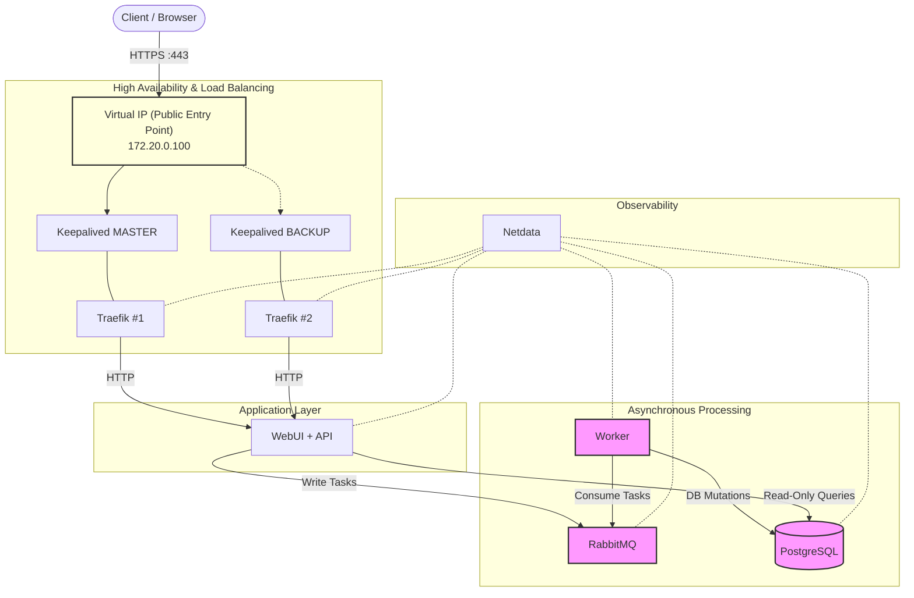

# High-Availability Containerized Web Platform (AMPS)

AMPS (Asynchronous Managed Processing System) is a containerized, high-availability web platform designed to demonstrate
**clean separation of concerns**, **asynchronous processing**, and **production-grade observability** using Docker-based
infrastructure.

The system is intentionally designed so that **no web-facing component ever mutates persistent state directly**. All
state changes are executed asynchronously by background workers.

---

## 1. System Overview

### Purpose

The goal of AMPS is to provide a reference architecture for:

- non-blocking user interfaces,
- reliable background processing,
- strict ownership of database mutations,
- clear operational visibility of all components.

This makes the system suitable both as a learning platform and as a solid foundation for real-world services.

### Architectural Principles

- **Asynchronous by default** – all create/update/delete operations are queued.
- **Single-writer rule** – only workers are allowed to mutate the database.
- **Loose coupling** – components communicate via message queues.
- **Observability-first** – every service is measurable at runtime.

### High-Level Architecture

Components communicate as follows:

```
WebUI / API (HTTP)
        ↓
RabbitMQ (AMQP Queue)
        ↓
Worker (Business Logic + Validation)
        ↓
PostgreSQL (Persistent State)
```

### Diagram


---

## 2. Components

| Component            | Service Name                   | Description                                                 | Notes                  |
|----------------------|--------------------------------|-------------------------------------------------------------|------------------------|
| **Edge Router / LB** | `traefik_1`, `traefik_2`       | HTTPS termination, routing, load balancing                  | HA via Keepalived      |
| **VIP Management**   | `keepalived_1`, `keepalived_2` | Virtual IP management (VRRP)                                | Ensures LB failover    |
| **Frontend + API**   | `app`                          | Web UI, authentication, request validation, task submission | Never writes to DB     |
| **Message Queue**    | `rabbitmq`                     | Durable AMQP queue for all mutations                        | Async backbone         |
| **Worker**           | `worker`                       | Executes all create/update/delete logic                     | Sole DB writer         |
| **Database**         | `db`                           | PostgreSQL persistent storage                               | Internal-only          |
| **Monitoring**       | `monitoring`                   | Netdata metrics for host and containers                     | Operational visibility |

---

## 3. Configuration

### 3.1 Exposed Ports

| Port  | Service    | Scope    | Purpose                   |
|-------|------------|----------|---------------------------|
| 80    | Traefik    | Public   | HTTP (redirect to HTTPS)  |
| 443   | Traefik    | Public   | HTTPS access to WebUI/API |
| 8080  | Traefik    | Internal | Traefik dashboard         |
| 15672 | RabbitMQ   | Public   | RabbitMQ management UI    |
| 19999 | Netdata    | Public   | Metrics dashboard         |
| 5432  | PostgreSQL | Internal | Database access           |

### 3.2 Environment Variables

| Variable            | Service     | Description                  |
|---------------------|-------------|------------------------------|
| `DATABASE_URL`      | app         | SQLAlchemy connection string |
| `SECRET_KEY`        | app         | Flask session signing key    |
| `RABBITMQ_HOST`     | app, worker | Broker hostname              |
| `POSTGRES_USER`     | db, worker  | DB user                      |
| `POSTGRES_PASSWORD` | db, worker  | DB password                  |
| `POSTGRES_DB`       | db, worker  | Database name                |

> Sensitive values are provided via `.env` or compose overrides and must not be committed.

### 3.3 Volumes

| Volume           | Purpose                    |
|------------------|----------------------------|
| `db_data`        | Persistent PostgreSQL data |
| `rabbitmq_data`  | Durable queue storage      |
| `netdata_config` | Netdata configuration      |
| `netdata_cache`  | Netdata runtime cache      |

---

## Quick Start

This section provides the fastest way to get the system running locally for evaluation or development.

### Prerequisites

- Docker Engine
- Docker Compose
- OpenSSL

### Steps

1. **Clone the repository**

```bash
git clone <repository-url>
cd amps
```

2. **Generate local TLS certificates**

```bash
bash scripts/generate_certs.sh
```

3. **Start the stack**

```bash
docker-compose up --build -d
```

4. **Verify everything is running**

```bash
docker-compose ps
```

You should see all services in `Up` state.

### Access Points

- WebUI / API: https://localhost
- Netdata (metrics): http://localhost:19999
- RabbitMQ Management: http://localhost:15672
- Traefik Dashboard (Edge Routing): http://localhost:8080

### Default Credentials (development only)

- **WebUI**
    - User: `admin@example.com`
    - Password: `admin123`

- **RabbitMQ**
    - User: `guest`
    - Password: `guest`

> ⚠️ These credentials are for local development only and must be changed for any non-local environment.

---

## 4. Running the Project

### Prerequisites

- Docker Engine
- Docker Compose
- OpenSSL (for local TLS)

### Startup Steps

1. **Generate certificates**

```bash
bash scripts/generate_certs.sh
```

2. **Start the full stack**

```bash
docker-compose up --build -d
```

3. **Verify services**

```bash
docker-compose ps
```

4. **Stop the stack**

```bash
docker-compose down
```

---

## 5. Testing & Validation

### Functional Validation

1. Open `https://localhost`
2. Login with:
    - user: `admin@example.com`
    - password: `admin123`
3. Create a new record from the UI.
4. You are immediately returned to the list view with:
   > “Record creation request accepted!”
5. Wait briefly and refresh – the record appears once processed by the worker.
6. Edit or delete the record – changes apply asynchronously.

### What This Proves

- UI is non-blocking
- DB mutations are async
- Worker owns all state changes
- System is resilient to worker delays

---

## 6. Configuration Files Reference

| File                        | Description               |
|-----------------------------|---------------------------|
| `docker-compose.yml`        | Main orchestration file   |
| `web_ui/Dockerfile`         | Flask + Gunicorn image    |
| `worker/Dockerfile`         | Background consumer image |
| `lb/keepalived-*.conf`      | HA VRRP configuration     |
| `lb/dynamic.yml`            | Traefik TLS and routing   |
| `scripts/generate_certs.sh` | Local TLS generation      |

---

## 7. Certificates and Security

- TLS is terminated at Traefik.
- Certificates are self-signed for local use.
- DB and Docker socket are isolated on private networks.
- Passwords are hashed in the worker using `werkzeug.security`.
- Plaintext credentials are never persisted.

---

## 8. Observability

Netdata provides:

- per-container CPU, memory, disk, network metrics,
- PostgreSQL performance charts,
- RabbitMQ queue depth and throughput,
- host-level resource usage.

Access via:

```
http://localhost:19999
```

---

## 9. Operational Guarantees

- No synchronous DB writes from web handlers
- Safe retries via AMQP
- Clear separation of responsibilities
- HA-ready by design

---

## 10. Intended Audience

- Backend / Platform Engineers
- DevOps / SREs
- Architecture reviewers
- Educational use (async systems)
